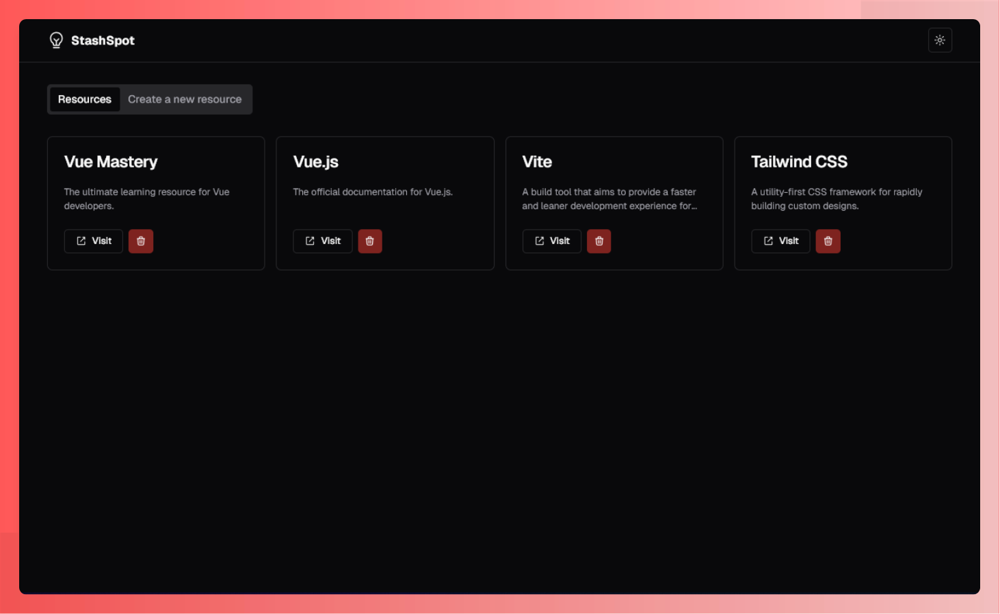

# 💡 StashSpot




## 📝 About the project

StashSpot is a lightweight web app designed for quickly saving and managing resource links. Users can add links with a title and description, view their saved resources, and delete them when no longer needed. All resources are stored in the browser's local storage, ensuring simplicity and privacy.

Built for learning purposes, StashSpot is developed using modern tools and technologies, including Vue, TypeScript, Tailwind CSS, Radix Vue, and ShadCN Vue. The app is thoroughly tested with Playwright to ensure functionality and reliability.

## 👩🏻‍💻 Technologies

This project uses the following technologies:

- Vue\
- TypeScript
- Tailwind CSS
- Radix Vue
- Shadcn Vue
- Vite
- Playwright
- Vitest
- Bun
- HTML
- CSS

## 👀 Live Preview

You can see the project live at the following link: [Monster Smash](https://stashspot.vercel.app)

## 💻 Prerequisites

Before you begin, make sure you meet the following requirements:

- You have a Windows / Linux / Mac machine;
- You have Git installed and configured.

## 🚀 Installing and using `stashspot`

The app was setup up with Bun.

### Install dependencies

```sh
bun install
```

### Compile and Hot-Reload for Development

```sh
bun dev
```

### Type-Check, Compile and Minify for Production

```sh
bun run build
```

### Run Unit Tests with [Vitest](https://vitest.dev/)

```sh
bun test:unit
```

### Run End-to-End Tests with [Playwright](https://playwright.dev)

```sh
# Install browsers for the first run
npx playwright install

# When testing on CI, must build the project first
bun run build

# Runs the end-to-end tests
bun test:e2e
# Runs the tests only on Chromium
bun test:e2e --project=chromium
# Runs the tests of a specific file
bun test:e2e tests/example.spec.ts
# Runs the tests in debug mode
bun test:e2e --debug
```

### Lint with [ESLint](https://eslint.org/)

```sh
bun lint
```

## 📫 Contributing to `stashspot`

Here's how to contribute to `stashspot`:

1. Fork this repository.
2. Create a branch: `git checkout -b <branch_name>`.
3. Make your changes and commit them: `git commit -m '<commit_message>'`
4. Push to the original branch: `git push origin stashspot / <location>`
5. Create the pull request.

Alternatively, see the GitHub documentation on [how to create a pull request](https://help.github.com/en/github/collaborating-with-issues-and-pull-requests/creating-a-pull-request).

## 🤝 Contributors

We thank the following people who contributed to this project:

<table>
  <tr>
    <td align="center">
      <a href="#" title="set the link title">
        <br>
        <sub>
          <b>Amanda Santos</b>
        </sub>
      </a>
    </td>
  </tr>
</table>
